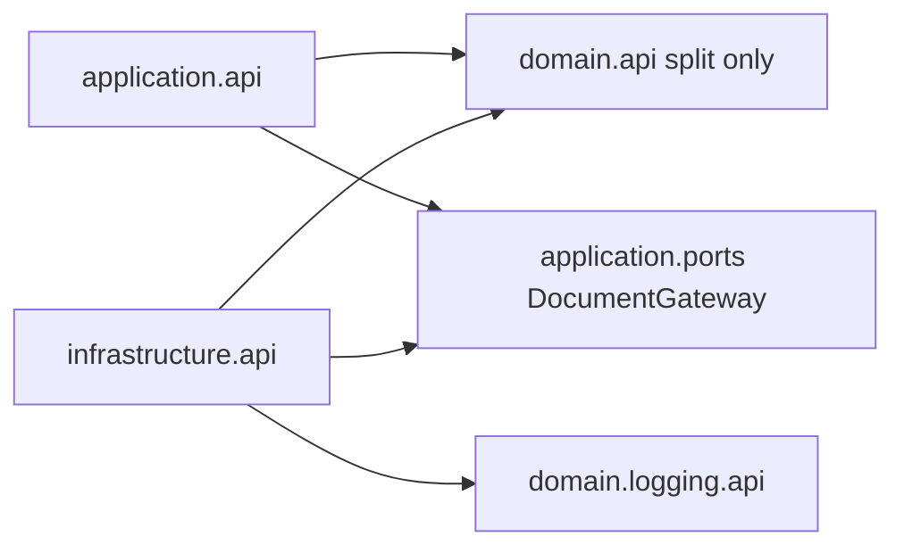
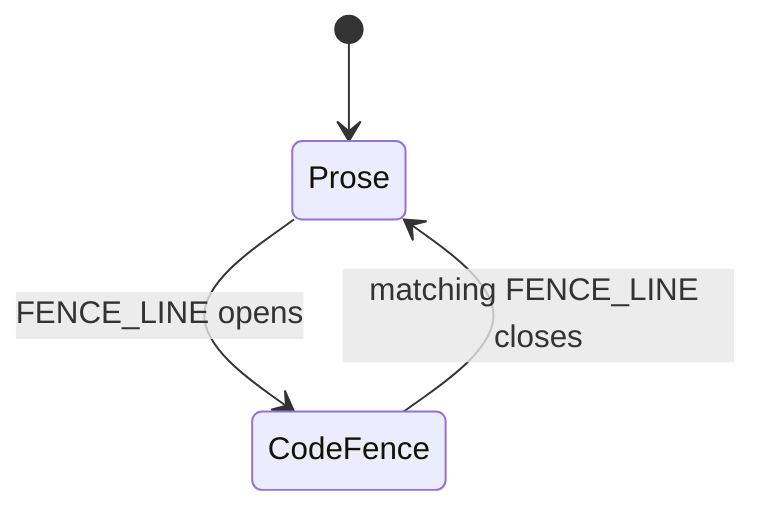
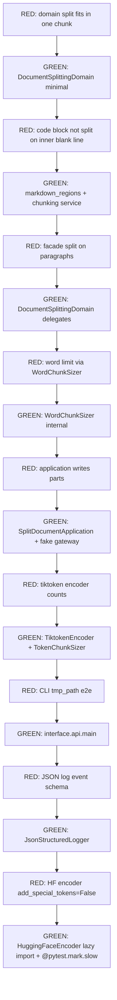
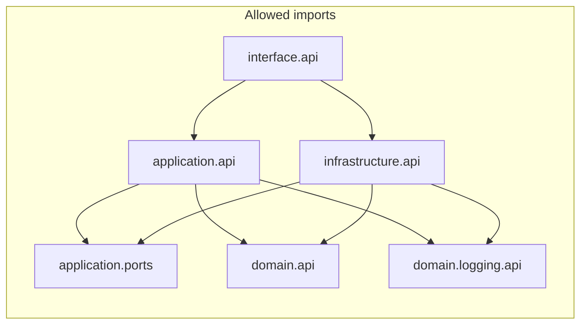
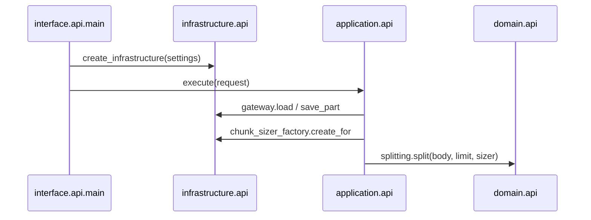

# tokdown markdown splitter (facade per domain + dual providers + logging)

## Context

[tokdown](d:/Projecten_Thuis/tokdown) — bounded context **markdown document splitting**.

**Chunking modes:** OpenAI tokens (`tiktoken`), Google tokens (HF Gemma), or `--words`.

**Architectural rule (mandatory):** Every layer/domain exposes **one simple public interface** (`api.py`). All deeper logic lives **outside** that interface in `_internal/` packages. Other layers may **only** import from `*.api`, never from `_internal`.

**Development method (mandatory):** **Test-driven development** with **pytest**, vertical slices. **Facade tests** for major behaviors; **direct `_internal` unit tests** allowed for complex markdown parsing (code fences) only.

**Architecture enforcement (mandatory):** **ruff** with **`TID252`** and **`flake8-tidy-imports.banned-api`** — mechanically ban `_internal` imports outside owning package (not code review alone).

## Architecture enforcement (ruff)

```bash
uv add --dev ruff
uv run ruff check src tests
uv run ruff format src tests
```

Add to [pyproject.toml](d:/Projecten_Thuis/tokdown/pyproject.toml):

```toml
[tool.ruff.lint]
select = [
  "E", "F", "I",
  "TID252",  # ban relative imports from parent modules (fragile cross-layer imports)
  "TID",     # flake8-tidy-imports (includes TID251 banned-api)
]

[tool.ruff.lint.flake8-tidy-imports]
# TID252: prefer absolute imports; avoids "from .._internal" escape hatches

[tool.ruff.lint.flake8-tidy-imports.banned-api]
"tokdown.interface._internal" = "Import tokdown.interface.api only."
"tokdown.application._internal" = "Import tokdown.application.api only."
"tokdown.infrastructure._internal" = "Import tokdown.infrastructure.api only."
"tokdown.domain._internal" = "Import tokdown.domain.api only (except domain/api.py and tests/domain/_internal/)."

[tool.ruff.lint.per-file-ignores]
"src/tokdown/domain/api.py" = ["TID251"]
"src/tokdown/application/api.py" = ["TID251"]
"src/tokdown/infrastructure/api.py" = ["TID251"]
"src/tokdown/interface/api.py" = ["TID251"]
"tests/domain/_internal/**" = ["TID251"]
```

**Allowed `_internal` imports:**

| Importer | May import `_internal`? |
|----------|-------------------------|
| Same layer `api.py` | Yes (facade delegates inward) |
| `tests/domain/_internal/**` | Yes (chunking edge cases only) |
| Application, interface, other layers | **No** (ruff fails CI) |

Run `ruff check` in verification alongside pytest.

## Pure domain vs application ports (Hydra correction)

**Problem:** Exporting `DocumentGateway` / `TokenEncoderFactory` from `domain/api.py` leaks I/O and construction into a layer that only needs `body: str` + `ChunkSizer`.

**Fix:**

| Concept | Layer | Notes |
|---------|-------|-------|
| `DocumentSplittingDomain.split(body, limit, sizer)` | **Domain** | Pure string math; no files, no providers |
| `ChunkLimit`, `ChunkUnit`, `ChunkSizer`, `TokenEncoder` protocol | **Domain** | Sizing abstractions only |
| `DocumentGateway`, `MarkdownDocument`, `DocumentPart`, `OutputDirectory` | **Application** | [`application/ports.py`](d:/Projecten_Thuis/tokdown/src/tokdown/application/ports.py) + DTOs in `application/api.py` |
| `TokenProvider`, `TokenEncoderFactory`, `ChunkSizerFactory` | **Infrastructure** | Built in `create_infrastructure`; never domain ports |
| `StructuredLogger` | **domain/logging/api.py** | Cross-cutting port (no filesystem) |

Domain `__all__` **must not** include `DocumentGateway`, `TokenEncoderFactory`, `TokenProvider`, `MarkdownDocument`, or `DocumentPart`.



## Markdown-aware chunking (code fences)

**Problem:** Naive `\n\n` splits break fenced blocks and poison LLM context when hard-split mid-fence.

**Solution:** `domain/_internal/markdown_regions.py` — robust fence detector + **auto-healing fences** on forced splits.

### Fence detection (robust regex)

Do **not** use `^```(\w*)$` alone. Per-line fence opener/closer match:

```python
FENCE_LINE = re.compile(r"^(\s*)(`{3,}|~{3,})(.*)$")
```

| Capture | Use |
|---------|-----|
| Group 1 | Leading indent (preserve on output) |
| Group 2 | Fence marker: `` ``` `` or `~~~`, length ≥ 3 |
| Group 3 | Info string (e.g. `python`, `bash script.sh`) — strip only for **language** tag on reopen; store raw |

**State machine:**

- **Closed:** line matches `FENCE_LINE` → open fence; record `marker_char` (`` ` `` or `~`), `marker_len`, `info_string`, `indent`.
- **Open:** line matches `FENCE_LINE` with **same** `marker_char` and `marker_len` → close fence (CommonMark closing fence may be shorter marker with optional info).
- Trailing spaces on fence lines allowed (regex anchors line content before optional strip).
- Malformed (open, no close) → fence until EOF.



| State | Split on `\n\n`? |
|-------|------------------|
| **Prose** | Yes |
| **Inside fence** | No (atomic until close or hard-split) |

### Auto-healing fences (LLM-safe hard-split)

When `MarkdownChunkingService` must hard-split **inside** an open fence:

1. Log **`code_block_hard_split`** (WARN) with `fence_language` / `marker` metadata.
2. **End of chunk A:** append `\n{indent}{marker * marker_len}\n` (closing fence).
3. **Start of chunk B:** prepend `\n{indent}{marker * marker_len}{info_string}\n` (re-open with same info string).

Chunk B remains valid markdown; the LLM still sees a fenced code context.

**TDD (required):**

- `tests/domain/_internal/test_chunking_service.py`: oversized ` ```python ` block → two chunks; chunk1 ends with closing fence; chunk2 starts with reopening fence; inner code syntax not orphaned outside fence.
- `test_markdown_regions.py`: tildes `~~~`; trailing spaces; info string ` ```bash script.sh `; 4-backtick markers if matched by `{3,}`.

Facade test: prose + fence under limit → single part unchanged.

`MarkdownChunkingService` consumes `markdown_regions.iter_regions(text)` — not raw `split("\n\n")`.

## TDD with pytest

### Tooling

```bash
uv add --dev pytest
uv run pytest
uv run pytest -q tests/domain
```

Configure in [pyproject.toml](d:/Projecten_Thuis/tokdown/pyproject.toml):

```toml
[dependency-groups]
dev = ["pytest>=8.0"]

[tool.pytest.ini_options]
testpaths = ["tests"]
pythonpath = ["src"]
```

(Use `dependency-groups.dev` or `[project.optional-dependencies] dev` per existing project style after `uv add --dev pytest`.)

### Test layout (facade-first + targeted internal)

```
tests/
  conftest.py              # shared fixtures: tmp paths, sample markdown, fake logger
  domain/
    test_splitting_api.py  # Facade: major behaviors (limits, multi-part, code block preserved)
    _internal/
      test_chunking_service.py   # Direct: fence toggling, prose splits, malformed fence
      test_markdown_regions.py   # Direct: region iterator edge cases
  domain/logging/
    test_logging_api.py    # LogEvent constants; fake logger contract
  application/
    test_application_api.py
  infrastructure/
    test_token_encoders.py # TiktokenEncoder, HuggingFaceEncoder (mark slow/network)
    test_filesystem_gateway.py
    test_json_logger.py
  interface/
    test_main_cli.py       # interface.api.main end-to-end with tmp_path
  fakes/
    fake_document_gateway.py
    fake_logger.py
    fake_token_encoder.py  # deterministic encode/decode for domain tests
```

**Import rules for tests:**

- **Default:** import facades (`tokdown.domain.api`) — same as production; enforced by ruff banned-api.
- **Exception:** `tests/domain/_internal/**` may import `tokdown.domain._internal.*` for markdown/chunking edge cases only (per-file ruff ignore).

### What to test (behaviors, not implementation)

| Layer | Public API under test | Example behaviors |
|-------|----------------------|-------------------|
| Domain (facade) | `DocumentSplittingDomain.split` | Under limit → one chunk; multi-part; word/token limits |
| Domain (internal) | `MarkdownChunkingService`, `iter_regions` | Tildes/trailing spaces/info strings; auto-heal on hard-split; malformed fence |
| Application | `SplitDocumentApplication.execute` | Writes parts; `PartFileExistsError` without `--force`; `--force` overwrites |
| Interface | `main()` + subprocess | **`transformers` and `tiktoken` absent from `sys.modules` after `--words` run** |
| Infrastructure | `create_infrastructure`, adapters | Tiktoken round-trip; JSON log line schema + `correlation_id`; gateway read/write UTF-8 |
| Interface | `main()` | Exit code 0/1; `--words`; `--provider openai`; `--quiet` suppresses stdout |

### Vertical slice order (implementation sequence)

Do **not** write all tests then all code. Follow **tracer bullet** order:



1. **Domain first** — highest value, no I/O; use `FakeTokenEncoder` with predictable id lengths.
2. **Application** — in-memory `DocumentGateway` fake; assert part files and counts via public result DTO.
3. **Infrastructure** — real tiktoken (offline); HF tests **`@pytest.mark.slow`** (skip in CI with `pytest -m "not slow"` unless cache warmed).
4. **Interface** — `main([...])` with `tmp_path` fixture and small `.md` files.

### Test doubles (fakes over mocks)

- **`FakeDocumentGateway`** — stores document in memory; records written parts (application tests).
- **`FakeStructuredLogger`** — captures `event()` calls for assertions (no JSON parsing in application tests).
- **`FakeTokenEncoder`** — e.g. 1 token per character or fixed chunk size (domain token tests without tiktoken).
- Prefer **fakes** implementing domain ports; avoid `unittest.mock` on `_internal` classes.

### Markers and CI

```python
@pytest.mark.slow  # HuggingFaceTokenizer — needs download or cache
```

Default local run: `uv run pytest -m "not slow"`. Full run before release: `uv run pytest`.

### Refactor discipline

After each green step: refactor `_internal` freely; **facade tests must stay green**. If a refactor breaks only `_internal` tests, those tests should not exist.

## Facade pattern (core principle)



(`AppPorts` = `application.ports.DocumentGateway` implemented by infrastructure.)

| Layer / subdomain | Public module | Facade responsibility | Internal (`_internal/`) |
|-------------------|---------------|----------------------|-------------------------|
| **Interface** | [`interface/api.py`](d:/Projecten_Thuis/tokdown/src/tokdown/interface/api.py) | `main(argv) -> int` | `cli.py`, `composition.py` |
| **Application** | [`application/api.py`](d:/Projecten_Thuis/tokdown/src/tokdown/application/api.py) + [`application/ports.py`](d:/Projecten_Thuis/tokdown/src/tokdown/application/ports.py) | `SplitDocumentApplication.execute`; `DocumentGateway` port | use case module |
| **Infrastructure** | [`infrastructure/api.py`](d:/Projecten_Thuis/tokdown/src/tokdown/infrastructure/api.py) | `create_infrastructure(settings) -> Infrastructure` | gateways, encoders, logger impl, sizer factory |
| **Splitting domain** | [`domain/api.py`](d:/Projecten_Thuis/tokdown/src/tokdown/domain/api.py) | `DocumentSplittingDomain.split(body, limit, sizer)` only | chunking, regions, sizers |
| **Logging subdomain** | [`domain/logging/api.py`](d:/Projecten_Thuis/tokdown/src/tokdown/domain/logging/api.py) | `StructuredLogger` port, `LogLevel`, `LogEvent` constants | (none in domain — impl in infra) |

**`Infrastructure` bundle** (dataclass returned by `create_infrastructure`):

- `document_gateway: DocumentGateway` — implements **`application.ports`**
- `chunk_sizer_factory: ChunkSizerFactory` — internal; lazy-loads encoders by `token_provider` + `model_id`
- `logger: StructuredLogger`
- `splitting_domain: DocumentSplittingDomain` — pure domain facade instance

No `TokenEncoderFactory` on the bundle (implementation detail inside `_internal`).

Application receives the bundle via constructor injection; it does not construct adapters itself.

### Import rules (ruff-enforced, not honor system)

See **Architecture enforcement (ruff)** above. `ruff check` must pass before merge.

- `domain/api.py` may import `domain._internal` (per-file ignore).
- All other production code imports **facades only**.

## Package layout

```
src/tokdown/
  __init__.py                    # from tokdown.interface.api import main
  interface/
    api.py                       # main()
    _internal/
      cli.py
      composition.py
  application/
    api.py                       # SplitDocumentApplication, Request/Result DTOs
    ports.py                     # DocumentGateway ABC, PartFileExistsError
    _internal/
      split_document.py          # use case: load → split → save
  domain/
    api.py                       # DocumentSplittingDomain + ChunkLimit/ChunkSizer only
    _internal/
      value_objects.py           # ChunkUnit, ChunkLimit only
      markdown_regions.py        # FENCE_LINE regex + iter_regions()
      sizing.py                  # ChunkSizer, TokenEncoder protocol, Token/WordChunkSizer
      services.py                # MarkdownChunkingService + auto-healing
    logging/
      api.py                     # StructuredLogger, LogLevel, LogEvent
  infrastructure/
    api.py                       # create_infrastructure, Infrastructure, InfraSettings
    _internal/
      filesystem_gateway.py
      tiktoken_encoder.py
      huggingface_encoder.py
      token_encoder_factory.py
      sizing_factory.py
      logging/
        json_logger.py
        sanitizer.py
        schema.py
```

## Splitting domain — public interface [`domain/api.py`](d:/Projecten_Thuis/tokdown/src/tokdown/domain/api.py)

Simple surface; hides `MarkdownChunkingService` and sizer classes:

```python
class DocumentSplittingDomain:
    """Single entry point for splitting domain logic."""

    def split(
        self,
        body: str,
        limit: ChunkLimit,
        sizer: ChunkSizer,
    ) -> list[str]:
        """Return chunk bodies, each within limit per sizer unit."""
        ...

# Factory helpers (optional, keep api small)
def chunk_limit(value: int, unit: ChunkUnit) -> ChunkLimit: ...

# Pure domain surface — no I/O ports
__all__ = [
    "DocumentSplittingDomain",
    "ChunkLimit", "ChunkUnit", "chunk_limit",
    "ChunkSizer", "TokenEncoder",
]
```

**Internal:** `domain/_internal/services.py` implements algorithm; `domain/api.py` delegates to a private service instance (composition inside the domain boundary only).

## Logging subdomain — public interface [`domain/logging/api.py`](d:/Projecten_Thuis/tokdown/src/tokdown/domain/logging/api.py)

```python
class LogLevel(Enum): ...
class LogEvent: ...  # semantic event name constants

class StructuredLogger(ABC):
    def event(self, level: LogLevel, event_name: str, **context: object) -> None: ...
```

No JSON, stderr, or sanitization in domain logging — those live in `infrastructure/_internal/logging/`.

## Application — [`application/api.py`](d:/Projecten_Thuis/tokdown/src/tokdown/application/api.py) + [`application/ports.py`](d:/Projecten_Thuis/tokdown/src/tokdown/application/ports.py)

**Ports (application layer, not domain):**

```python
class DocumentGateway(ABC):
    def load(self, path: Path) -> MarkdownDocument: ...
    def save_part(self, document: MarkdownDocument, part: DocumentPart, directory: Path, *, force: bool) -> None: ...

class PartFileExistsError(Exception):
    """Raised when {stem}_part{n}.md exists and force=False."""
```

**Facade DTOs:**

```python
@dataclass(frozen=True)
class SplitDocumentRequest:
    source_path: Path
    limit: ChunkLimit          # from domain.api
    token_provider: str      # "openai" | "google" — infra concern, not domain enum
    model_id: str
    output_dir: Path | None
    force: bool = False        # CLI --force

class SplitDocumentApplication:
    def execute(self, request: SplitDocumentRequest) -> SplitDocumentResult: ...
```

**Internal flow:** `gateway.load` → `infrastructure.chunk_sizer_factory.create_for(request)` → `domain.splitting.split(document.body, ...)` → `gateway.save_part(..., force=request.force)` → on `PartFileExistsError`, log `output_file_exists` (ERROR) and fail gracefully (CLI exit 1).

Re-export `DocumentGateway`, `PartFileExistsError`, `MarkdownDocument`, `DocumentPart` from `application/api.py` for infrastructure implements.

## Infrastructure — public interface [`infrastructure/api.py`](d:/Projecten_Thuis/tokdown/src/tokdown/infrastructure/api.py)

```python
@dataclass(frozen=True)
class InfraSettings:
    log_level: LogLevel
    log_format: str  # json | text
    correlation_id: str

@dataclass(frozen=True)
class Infrastructure:
    document_gateway: DocumentGateway      # implements application.ports
    chunk_sizer_factory: ChunkSizerFactory # internal; uses lazy encoders
    logger: StructuredLogger

def create_infrastructure(settings: InfraSettings) -> Infrastructure: ...
```

`TokenEncoderFactory` is **private to infrastructure** `_internal` (not exported from `infrastructure/api.py`). `ChunkSizerFactory` is the only encoder entry point for the application.

All tiktoken/HF/filesystem/JSON details stay in `_internal/`.

### Token providers (internal adapters)

| Internal class | Provider | Import rule |
|----------------|----------|-------------|
| `TiktokenEncoder` | `openai` | `import tiktoken` **inside** factory method only |
| `HuggingFaceEncoder` | `google` | `from transformers import AutoTokenizer` **inside** `create()` only |
| `CompositeTokenEncoderFactory` | routes by `TokenProvider` | **No** top-level `transformers` / `tiktoken` import |

### Google tokenizer accuracy (required)

In `HuggingFaceEncoder` / `TokenChunkSizer` path, **every** encode used for measure or hard-split:

```python
tokenizer.encode(text, add_special_tokens=False)
```

Never count `<bos>` / special tokens toward chunk limits. Decode paths stay consistent with encoded id slices. Add an infrastructure unit test asserting a known string’s token count **decreases** vs `add_special_tokens=True` (or matches fixed expected count).

### Lazy imports + HF library silencing (CLI UX)

**Lazy import rules:**

- No top-level `transformers` / `tiktoken` in `infrastructure/api.py`, `composition.py`, or `CompositeTokenEncoderFactory`.
- `HuggingFaceEncoderFactory.create()` and `TiktokenEncoderFactory.create()` import inside the method only.
- `--words` never loads either library.

**Silence upstream HF noise** (inside `HuggingFaceEncoderFactory.create()`, before `from_pretrained`):

```python
import os
os.environ.setdefault("TOKENIZERS_PARALLELISM", "false")
# after lazy import transformers:
from transformers.utils import logging as hf_logging
hf_logging.set_verbosity_error()
```

Prevents `UserWarning` / INFO spam on stderr that bypasses `StructuredLogger`.

### Automated lazy-load regression test (required)

`tests/interface/test_main_cli.py`:

```python
def test_words_mode_does_not_import_heavy_tokenizers(tmp_path, monkeypatch):
    # subprocess: uv run python -c helper that runs main() with --words
    # helper prints json.dumps({k: k in sys.modules for k in ("transformers", "tiktoken")})
    assert loaded == {"transformers": False, "tiktoken": False}
```

Use **subprocess** (fresh interpreter), not in-process `main()`, so imports from test collection do not pollute `sys.modules`. Same file may include tmp_path CLI e2e tests.

## Interface — public interface [`interface/api.py`](d:/Projecten_Thuis/tokdown/src/tokdown/interface/api.py)

```python
def main(argv: list[str] | None = None) -> int:
    """CLI entry: parse args, create infrastructure, run application."""
```

**Internal:** `CliController` + `CompositionRoot` (parse `--provider`, `--words`, `-m`, logging flags; build `InfraSettings`; call `create_infrastructure`; call `SplitDocumentApplication.execute`).

## Chunking modes & CLI (unchanged behavior)

| Mode | CLI |
|------|-----|
| Google tokens | default `--provider google`, `-m google/gemma-2-2b` |
| OpenAI tokens | `--provider openai`, `-m cl100k_base` |
| Words | `--words` |

```text
tokdown [options] <input_file> <limit> [output_dir]
```

| Flag | Role |
|------|------|
| `--force` | Overwrite existing `{stem}_part{n}.md`; default refuse with `PartFileExistsError` |
| `--log-level`, `--log-format`, `--quiet` | Logging / stdout UX |

`--force` mapped to `SplitDocumentRequest.force`.

## Dependencies

- **Keep** `tiktoken`
- **Add** `transformers`, `sentencepiece` (runtime import only inside `HuggingFaceEncoder` adapter)
- **Dev:** `pytest`, `ruff`

## Structured logging (cross-cutting)

- JSON / text formatting → `infrastructure/_internal/logging/` only
- Semantic events → `domain/logging/api.py` (`LogEvent.*`)
- Fields: `correlation_id`, `token_provider`, `event`, snake_case keys, no PII
- Application internal calls `infrastructure.logger.event(...)` via port from bundle

## Composition flow



## README

- Usage for three modes
- **Architecture:** one `api.py` per layer; do not import `_internal` from outside its package
- **Development:** `uv run pytest` (TDD workflow)
- Logging and provider notes

## Verification

**Primary (automated):**

```bash
uv sync
uv run ruff check src tests
uv run pytest -m "not slow"
uv run pytest   # optional full run including HF
```

**Manual smoke (after green suite):**

```bash
uv run tokdown --provider openai test.md 100
uv run tokdown --provider google test.md 100
uv run tokdown --words test.md 50
```

## SRP + facade checklist

| Concern | Public | Internal |
|---------|--------|----------|
| Split algorithm | `DocumentSplittingDomain.split` | `MarkdownChunkingService`, `markdown_regions` |
| Fence tracking | — | `iter_regions` state machine |
| OpenAI encode | — | `TiktokenEncoder` |
| Google encode | — | `HuggingFaceEncoder` |
| Files I/O | `DocumentGateway` (**application** port) | `FileSystemDocumentGateway` |
| Overwrite policy | `SplitDocumentRequest.force` | gateway `save_part(..., force=)` |
| JSON logs | `StructuredLogger` (port) | `JsonStructuredLogger` |
| CLI | `main()` | `CliController` |
| Orchestration | `SplitDocumentApplication.execute` | use case module |

## What we are not doing

- No horizontal TDD (bulk tests then bulk impl)
- No broad `_internal` testing outside `tests/domain/_internal/` (markdown/chunking only)
- No plugin system for third-party encoders in v1
- No indented (4-space) code blocks as fences in v1 — `` ``` `` and `~~~` only
- No full CommonMark AST — line-based fence regex only

## Risks / limitations

- Same text → different token counts per provider; match `--provider` to target LLM.
- HF first-run download (Google only); silenced stderr does not remove download latency.
- Auto-healing adds extra fence lines to token/word counts (small overhead; preferable to invalid markdown).
- Tid252 + banned-api must stay in CI; regressions are merge blockers.

## Hydra review — incorporated

| Finding | Resolution |
|---------|------------|
| Domain leaks I/O ports | `DocumentGateway` → `application/ports.py`; domain exports split + sizing only |
| Brittle fence regex | `^(\s*)(`{3,}\|~{3,})(.*)$` + matching close by char/length |
| Hard-split poisons LLM context | Auto-healing close/reopen fences on chunk boundaries |
| HF stderr spam | `TOKENIZERS_PARALLELISM=false`, `set_verbosity_error()` in lazy block |
| Blind overwrite | `--force` + `PartFileExistsError` + `output_file_exists` log event |
| Lazy-load not proven | Mandatory subprocess `sys.modules` test for `--words` |
