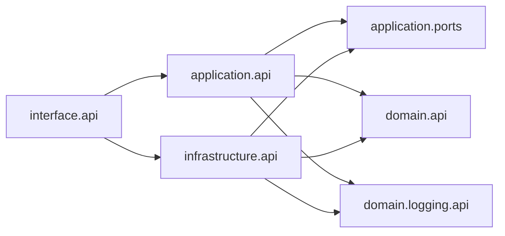

# ADR 001: Layered facades and import boundaries

## Status

Accepted

## Context

Tokdown splits markdown documents into size-bounded parts for LLM context windows. The bounded context is **markdown document splitting** with optional token counting (`count`) and file output (`split`).

We need:

- Testable layers without leaking filesystem, tokenizers, or CLI parsing into pure splitting logic.
- A stable public surface per layer so refactors under `_internal/` do not break callers.
- Mechanical enforcement of import rules (not code review alone).

## Decision

### Facade per layer

Each layer exposes **one public module** (`api.py`). Deeper logic lives in `_internal/` and is wired inside the layer (composition modules). Other packages import **facades only**, never another layer’s `_internal`.

| Layer | Public surface | Responsibility |
| ----- | -------------- | -------------- |
| **Interface** | `interface.api` | CLI entry (`main`), argv parsing |
| **Application** | `application.api`, `application.ports` | `SplitDocumentApplication`, `CountDocumentApplication`, DTOs; `DocumentGateway` port |
| **Domain** | `domain.api` | Pure string splitting (`DocumentSplittingDomain`, sizing types) |
| **Domain logging** | `domain.logging.api` | `StructuredLogger` port, `LogEvent` constants |
| **Infrastructure** | `infrastructure.api` | `create_infrastructure()` — gateways, encoders, logger implementations |

Non-domain `api.py` files re-export from their layer’s composition with a single `# noqa: TID251` import. `domain/api.py` uses a file-level TID251 ignore because it is the only public entry into domain internals.

### Pure domain vs application ports

**Domain** receives `body: str`, a limit, and a `ChunkSizer` — no files, no provider enums, no gateways.

**Application** owns I/O boundaries: `DocumentGateway` (load/save parts), `PartFileExistsError`, and use cases that orchestrate domain + infrastructure.

**Infrastructure** implements application ports and builds token/word sizers with lazy-loaded `tiktoken` / `transformers`.

This keeps splitting math reusable and prevents I/O from appearing on `domain.api`.

### Allowed imports

| From | May import |
| ---- | ---------- |
| `interface` | `application.api`, `domain.api`, `infrastructure.api` |
| `application` | `domain.api`, `application.ports` |
| `infrastructure` | `application.ports`, `domain.api`, `domain.logging.api` |
| `domain` (other packages) | `domain.api` only |
| `<layer>/_internal/**` | Same layer’s `_internal` only |
| Non-domain `api.py` | Its own `_internal.composition` only (one `# noqa: TID251` line) |
| `domain/api.py` | `domain._internal` (file-level TID251 ignore) |
| `tests/domain/_internal/` | `domain._internal` (chunking / fence edge cases only) |

### Layer dependencies



## Enforcement

Cross-layer `_internal` imports are **merge blockers**.

1. **Ruff** — `TID252` and `flake8-tidy-imports` `banned-api` in `pyproject.toml` ban `tokdown.*._internal` outside the owning package (with per-file ignores for `domain/api.py` and `tests/domain/_internal/**`).
2. **Architecture test** — `tests/architecture/test_internal_import_boundaries.py` AST-walks `src/tokdown` for violations.

```bash
uv run ruff check src tests
uv run pytest tests/architecture -q
```

## Consequences

### Positive

- Refactors can move files under `_internal/` without updating user-facing README or cross-layer imports.
- Facade tests document behavior; only markdown fence edge cases need direct `_internal` domain tests.
- CI and local checks catch boundary regressions automatically.

### Negative

- Extra indirection (composition + thin `api.py` re-exports).
- Contributors must read this ADR (or run the architecture test) before adding cross-layer imports.

## Related

- User-facing usage: [README.md](../../README.md)
- Contributor workflow: [AGENTS.md](../../AGENTS.md)
