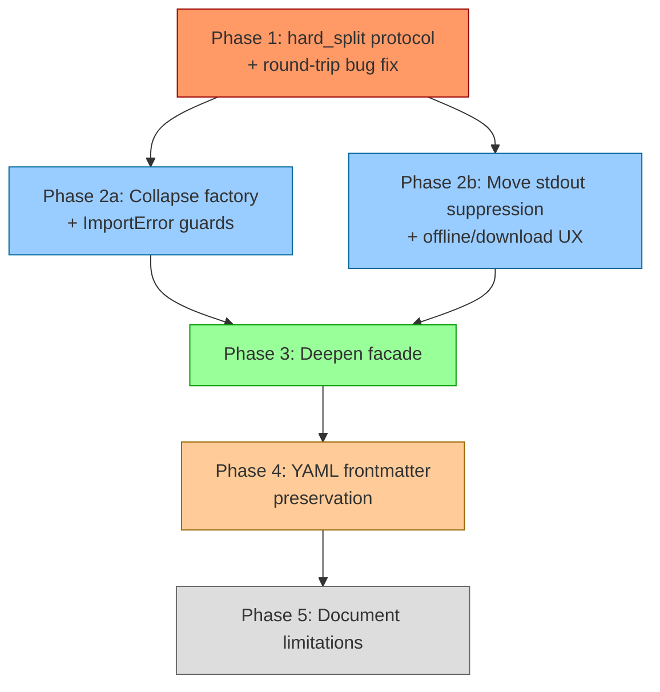

# Plan: Deepen tokdown Architecture (5 Phases)

All feedback folded in. Default provider stays `google`, deps stay required, whitespace normalization and OOM are documented limitations (not fixed).

---

## Phase 1: Add `hard_split` to ChunkSizer + fix round-trip bug

**Goal:** Remove `getattr(sizer, "encoder", None)` hack + fix the tokenizer round-trip crash.

**The bug (QA feedback):** `_hard_split_tokens` slices token IDs by limit, decodes the chunk, then re-encodes to verify size. But `decode→encode` is asymmetric (subword normalization, prefix spaces). The assertion `len(encoder.encode(chunk)) > limit` will randomly crash on edge-case text.

**Fix:** Remove the assertion. The token-id slice is correct by construction — it was already `<= limit` tokens. Trust the slice.

**Steps:**

1. Extend `ChunkSizer` protocol with `hard_split(self, text: str, limit: int) -> list[str]`
2. Implement on `WordChunkSizer` (move logic from `services.py::_hard_split`)
3. Implement on `TokenChunkSizer` (move logic from `_hard_split_tokens`, **without** the round-trip assertion)
4. Simplify `services.py` — `_hard_split` becomes `sizer.hard_split(text, limit.value)`. Delete `_hard_split_tokens`. Remove `getattr` hack.
5. Tests: existing pass + new unit tests for each sizer's `hard_split` + edge-case round-trip test

**Files:** `sizing.py`, `services.py`, `token_chunk_sizer.py`, test files

---

## Phase 2a: Collapse factory hierarchy + ImportError guards (*parallel with 2b*)

**Goal:** One module, one decision tree. Kill factory-of-factories. Add defensive `ImportError` handling.

**Steps:**

1. Absorb dispatch logic into `sizing_factory.py` — direct routing by provider name
2. **DELETE** `token_encoder_factory.py` (abstract base + composite — zero value)
3. Add `try/except ImportError` in encoder files with user-friendly messages
4. Simplify encoder files — factory classes become `create_encoder(model_id)` functions

**Files:** `sizing_factory.py`, `token_encoder_factory.py` (DELETE), `tiktoken_encoder.py`, `huggingface_encoder.py`

---

## Phase 2b: Move stdout suppression + offline/download UX (*parallel with 2a*)

**Goal:** Adapters suppress their own noise. First-download shows progress (not a frozen terminal). Offline failures give clear errors.

**The UX problem (AI Engineer + Mobile feedback):** Suppressing progress bars means first-time users stare at a frozen terminal while gigabytes download. And offline users get cryptic network errors.

**Steps:**

1. Create `suppress_stdout.py` in infrastructure
2. In `huggingface_encoder.py`:
   - If model cached → suppress stdout, fast path
   - If model NOT cached → allow progress bars on stderr, print "Downloading tokenizer..."
   - If offline + not cached → raise clear error: "Model not cached and network unavailable"
3. Same pattern for tiktoken (downloads encoding files on first use)
4. **DELETE** `interface/_internal/stdout_clean.py`, remove wrapper from `cli.py`
5. Tests: stdout not polluted (cached), offline error message correct

**Files:** `suppress_stdout.py` (NEW), `huggingface_encoder.py`, `tiktoken_encoder.py`, `stdout_clean.py` (DELETE), `cli.py`

---

## Phase 3: Deepen `DocumentSplittingDomain` facade

**Goal:** Facade absorbs validation. Service becomes pure algorithm.

**Steps:**

1. Move `if limit.value <= 0: raise ValueError` and `if not body: return [""]` into `DocumentSplittingDomain.split()`
2. Remove guards from `MarkdownChunkingService.split()` — assumes valid inputs
3. Test validation at facade level

**Files:** `domain/api.py`, `services.py`, test files

---

## Phase 4: YAML frontmatter preservation

**Goal:** Part 1 keeps frontmatter intact. Subsequent parts don't receive it.

**The problem (PM feedback):** `--- title: ... ---` at file start is treated as prose. Only part 1 gets it by luck of splitting position. If the split boundary falls inside frontmatter, it's corrupted.

**Steps:**

1. Add `RegionKind.FRONTMATTER` to `markdown_regions.py` — detect `---\n...\n---` at file start
2. Make splitter glue frontmatter to first chunk (unsplittable, counts against limit)
3. If frontmatter alone exceeds limit: warn + include anyway (don't crash)
4. Edge case: unclosed frontmatter → treat as prose

**Files:** `markdown_regions.py`, `services.py`, `domain/logging/api.py` (optional event), test files

---

## Phase 5: Document accepted limitations

**Goal:** Transparency about design trade-offs.

**Steps:** Add "Limitations" section to `README.md`:

- Whitespace normalization: `\n\n\n` → `\n\n` (by design, markdown renderers treat identically)
- File size: entire file loaded to memory. Designed for LLM context prep, not multi-GB logs.

**Files:** `README.md`

---

## Decisions

| Decision | Rationale |
|----------|-----------|
| Default provider stays `google` | Matches local-LLM use case |
| Deps stay required | Simpler install story; ImportError is defensive only |
| Frontmatter in part 1 only | User decision — no replication |
| Whitespace normalization accepted | Markdown renderers don't distinguish; fixing adds complexity without user benefit |
| OOM documented, not fixed | Tool is for LLM context prep, not 2GB log processing |
| Round-trip assertion removed | Token-id slice is correct by construction; assertion crashes on valid inputs |

---

## Verification

1. `uv run pytest` — green after each phase
2. `uv run ruff check src/ tests/` — lint clean
3. `uv run pytest tests/architecture/` — boundary enforcement holds
4. Manual: frontmatter file → part 1 has it, part 2+ don't
5. Manual: offline + uncached model → clear error message
6. Manual: first download → progress visible on stderr
